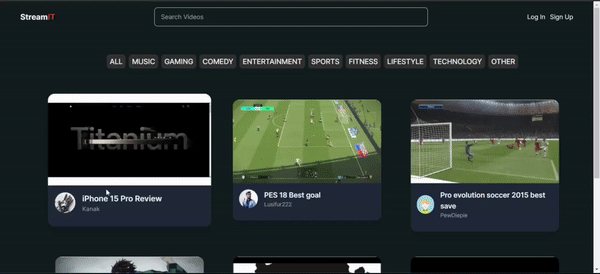

# StreamIt

This is **StreamIt**. A video sharing and streaming platform where user can create account and upload video and do real-time streaming with interactive functionalities like likes and comments.

*Why i chose this project?*  
 I am fascinated by how video streaming sites like YouTube work, and I wanted to learn full-stack development in Next.js. That's why I chose this project. I strongly 
 believe in **learning by doing**.

 ***Installation 
  To get a local copy up and running, follow these simple steps:  
  ### Prerequisites
   Make sure you have the following installed:
   - [Node.js](https://nodejs.org/) (LTS version recommended)
   - [npm](https://www.npmjs.com/) or [yarn](https://yarnpkg.com/)
  ***Running on your system 
   - Clone or Download the code
   - cd streamIt ( Change directory to StreamIt ) 
   - npm install (Install packages)
   - npm start (Start the project)
   - Open your browser and go to http://localhost:3000 to see the project in action.

  ***Contributing
   Fork the repo
   Create your feature branch (git checkout -b feature/AmazingFeature)
   Commit your changes (git commit -m 'Add some AmazingFeature')
   Push to the branch (git push origin feature/AmazingFeature)
   Open a pull request
  
 
